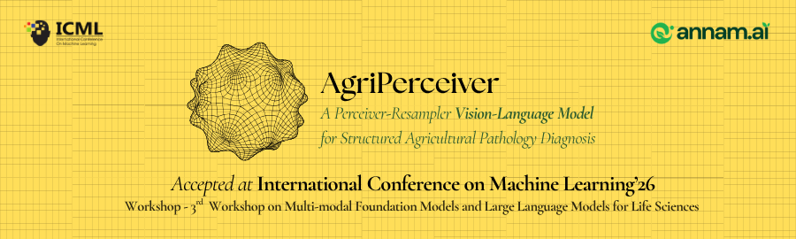

<div align="center">



# AgriPerceiver

### A Perceiver-Resampler Vision-Language Model for Structured Agricultural Pathology Diagnosis

*Accepted — ICML 2026, 3rd Workshop on Multi-modal Foundation Models and Large Language Models for Life Sciences*

<br/>

[](https://icml.cc/virtual/2026/72095)
[](#)
[](https://icml2026fm4ls.github.io/index.html)
[](https://icml.cc/)
[](#)
[](#)
[](LICENSE)
[](https://www.python.org/)

<br/>

**[Vatsal Khanna](https://github.com/VatsalKhanna5)**  &nbsp;&amp;&nbsp;  **[Davinder Singh](https://github.com/Davinder1436)**

</div>

---

## Overview

AgriPerceiver is a lightweight, domain-specialized vision-language model designed for structured agricultural pathology diagnosis. Given a photograph of a plant leaf, the model produces a structured JSON diagnostic report covering disease identification, pathology type, severity assessment, visual symptom analysis, pathological reasoning, and actionable treatment recommendations.

The central architectural contribution is a **Perceiver Resampler bridge** that compresses 3,645 patch-level visual tokens into 128 latent vectors i.e. a 28.5× reduction, enabling efficient multimodal fusion without sacrificing the spatial fidelity required for fine-grained lesion characterization. This bridge is trained in two curriculum stages: a general visual-language alignment stage (frozen backbones, bridge only), followed by domain specialization via LoRA fine-tuning on 101K agronomist-labeled samples generated by an automated Gemma-3-based labeling pipeline.

AgriPerceiver achieves a composite score of **0.717** on a 5,062-sample test set, outperforming 7–8B parameter general-purpose VLM baselines (LLaVA-NeXT-7B, InternVL2-8B, Qwen2-VL-7B) by a margin of **+19–21 composite points**, with particularly large gains on fine-grained pathology classification (Type-F1: 0.645 vs. best baseline 0.336) and severity regression (MAE: 0.067 vs. best baseline 0.224).

---

## Key Contributions

- **Perceiver Resampler bridge** — 28.5× visual token compression (3,645 → 128 latents) via cross-attention over learned queries, preserving spatial fidelity while keeping LLM context length tractable
- **AnyRes multi-scale tiling** — 5-tile spatial decomposition (4 quadrants + global context) with learned per-tile position embeddings for localizing spatially distributed lesion patterns
- **Backbone-agnostic perception module** — the bridge is fully decoupled from vision encoder and language model choices, enabling substitution without architectural modifications
- **Two-stage curriculum training** — Stage 1 aligns the bridge to the LLM embedding space (~50M trainable parameters); Stage 2 specializes via LoRA (r=32, α=64, ~35M additional trainable parameters, ~2% of total model size)
- **Automated agronomic labeling pipeline** — Gemma-3-12B-IT with JSON pre-fill forcing generates structured diagnostic labels from 117,635 raw images across 57 disease categories; confidence-weighted filtering retains 101,301 high-quality samples
- **Comprehensive evaluation suite** — 9 metrics spanning structural validity, classification, regression, calibration, and semantic similarity, with LLM-as-judge consensus scoring across 5 clinical axes

---

## Architecture

```
Input Image (H × W × 3)
        │
        ├─ AnyRes Tiling ─────────────────── 5 tiles × 384 × 384
        │
        ├─ SigLIP-SO400M-patch14-384 ─────── [5, 729, 1152]  patch features  (frozen)
        │
        ├─ TileEmbeddings ────────────────── + learned spatial position per tile
        │
        ├─ VisionProjector (MLP) ─────────── 1152 → 3072  (match LLM hidden dim)
        │
        ├─ PerceiverResampler ────────────── 3,645 tokens → 128 latents  (28.5× ↓)
        │   └─ 6 × [CrossAttention(Q=latents, KV=patch) + SelfAttention + GLU-FFN]
        │
        └─ Splice into Phi-3 ─────────────── [<|image_start|>  128 latents  <|image_end|>]
                                                            │
                                                            ▼
                                             Phi-3-mini-128k-instruct  (3.8B, LoRA r=32)
                                                            │
                                                            ▼
                                             Structured JSON diagnostic report
```

| Component | Backbone | Parameters | Training |
|---|---|---|---|
| Vision Encoder | SigLIP-SO400M-patch14-384 | ~400M | Frozen |
| Perception Bridge | Perceiver + Projector + TileEmbed | ~50M | Stage 1 + 2 |
| Language Model | Phi-3-mini-128k-instruct | ~3.8B | LoRA only (Stage 2) |
| **Total trainable (Stage 2)** | — | **~85M** | **~2% of total** |

---

## Results

### Main Comparison

Evaluation on a held-out test set of 5,062 samples. All baselines receive the same structured JSON prompt; no fine-tuning is applied to baselines.

| Model | Params | JSON% | Schema% | Type-F1 ↑ | Diag-FM ↑ | Sev-MAE ↓ | Sev-r ↑ | BERT-sym ↑ | ECE ↓ | **Composite ↑** |
|---|---|---|---|---|---|---|---|---|---|---|
| LLaVA-NeXT-7B | 7B | 99.9 | 99.9 | 0.134 | 0.001 | 0.344 | 0.226 | 0.847 | 0.004 | 0.504 |
| InternVL2-8B | 8B | 100.0 | 100.0 | 0.336 | 0.005 | 0.385 | 0.624 | 0.848 | 0.384 | 0.523 |
| Qwen2-VL-7B | 7B | 99.9 | 99.9 | 0.287 | 0.001 | 0.224 | 0.666 | 0.830 | 0.372 | 0.527 |
| **AgriPerceiver** | **4.6B** | **99.7** | **99.7** | **0.645** | **0.486** | **0.067** | **0.855** | **~0.92** | **0.139** | **0.717** |

> The composite score $\mathcal{C}$ is a weighted sum: $0.20\,F_1^{\text{type}} + 0.15\,F_{\text{diag}} + 0.15\,B_{\text{sym}} + 0.10\,(1-\text{MAE}) + 0.10\,B_{\text{reas}} + 0.10\,B_{\text{act}} + 0.10\,J_{\text{val}} + 0.05\,(1-\text{ECE}) + 0.05\,S_{\text{cmp}}$. All components in [0, 1]. See [docs/EVALUATION.md](docs/EVALUATION.md) for metric definitions.

### Per-Class Type-F1

| Pathology Class | Support | LLaVA-NeXT | InternVL2 | Qwen2-VL | AgriPerceiver |
|---|---|---|---|---|---|
| Bacterial | 692 | 0.000 | 0.003 | 0.025 | — |
| Deficiency | 618 | 0.006 | 0.475 | 0.386 | — |
| Fungal | 1,521 | 0.301 | 0.599 | 0.637 | **0.813** |
| Pest | 351 | 0.000 | 0.227 | 0.017 | **0.541** |
| Viral | 345 | 0.006 | 0.022 | 0.022 | **0.525** |
| Unknown | 1,535 | 0.493 | 0.689 | 0.634 | **0.827** |
| **Macro avg** | 5,062 | 0.134 | 0.336 | 0.287 | **0.645** |

### Ablation Study

| Variant | Composite | Δ vs. Full |
|---|---|---|
| Full model | 0.7175 | — |
| − AnyRes (single tile, 729 tokens) | 0.7141 | −0.003 |
| − Tile embeddings | TBD | TBD |
| − Stage-2 LoRA (Stage-1 bridge only) | TBD | TBD |

Full results and per-metric breakdowns are in [paper/RESULTS.md](paper/RESULTS.md).

---

## Installation

```bash
# Clone the repository
git clone https://github.com/VatsalKhanna5/agri-perceiver.git
cd agri-perceiver

# Install with core dependencies
pip install -e .

# Install with evaluation dependencies (BERTScore, scikit-learn, etc.)
pip install -e ".[eval]"

# Install with training dependencies (wandb, bitsandbytes)
pip install -e ".[train]"

# Full installation (all extras)
pip install -e ".[eval,train,dev]"
```

**Requirements:** Python ≥ 3.10, PyTorch ≥ 2.1, CUDA 11.8+ recommended.

---

## Model Weights & Data

> Model checkpoints and the training dataset will be released on HuggingFace upon camera-ready submission.

| Artifact | Status | Link |
|---|---|---|
| `agri-perceiver/specialist-e3` — Stage-2 fine-tuned weights | Coming soon | [](#) |
| `agri-perceiver/stage1-bridge` — Stage-1 connector weights | Coming soon | [](#) |
| `agri-perceiver/canonical-dataset` — 101K training samples | Coming soon | [](#) |

---

## Usage

### Single-Image Inference

```python
from agri_perceiver.inference.predictor import AgriPredictor

predictor = AgriPredictor("checkpoints/specialist_e3.pt")
report = predictor.predict("path/to/leaf.jpg")
print(report)
```

The returned `report` is a Pydantic model (see [src/agri_perceiver/inference/schema.py](src/agri_perceiver/inference/schema.py)) with the following fields:

```json
{
  "pathology_type": "fungal",
  "diagnosis": "Alternaria leaf blight",
  "severity": 0.72,
  "symptoms": "Circular necrotic lesions with concentric zonation and chlorotic halo...",
  "pathological_reasoning": "Sporulation pattern and concentric ring morphology are consistent with...",
  "recommended_actions": "Apply mancozeb (2g/L) at 10-day intervals; remove and destroy infected debris...",
  "confidence": 0.89
}
```

### CLI

```bash
# Single image inference
agri-predict --image leaf.jpg --checkpoint checkpoints/specialist_e3.pt

# Batch evaluation
agri-eval --predictions preds.jsonl --ground-truth gt.jsonl --output results/eval_results.json
```

### Training

```bash
# Stage 1 — Visual-language alignment (bridge only, ~50M trainable params)
python -m agri_perceiver.training.train_stage1 \
    --config configs/stage1_alignment.yaml \
    --data data/alignment/generic_alignment.jsonl \
    --data-root /path/to/images \
    --output checkpoints/stage1_connector_weights.pt

# Stage 2 — Agricultural specialization (bridge + LoRA, ~85M trainable params)
python -m agri_perceiver.training.train_stage2 \
    --config configs/stage2_specialization.yaml \
    --data final_train_canonical.jsonl \
    --data-root canonical_dataset/processed_images/ \
    --bridge-weights checkpoints/stage1_connector_weights.pt \
    --output checkpoints/specialist_e{epoch}.pt
```

### Evaluation

```bash
# Run full evaluation suite (9 metrics + composite score)
agri-eval \
    --predictions results/agri_perceiver_predictions.jsonl \
    --ground-truth data/test_split_gt.jsonl \
    --output results/eval_results.json

# Run baseline inference
python scripts/run_baseline_inference.py --model internvl2-8b --output results/

# Run ablation studies
python scripts/run_ablation.py --ablation no_anyres --checkpoint checkpoints/specialist_e3.pt
```

---

## Data Pipeline

The training corpus is built using a fully automated Gemma-3-12B-IT labeling pipeline:

```
117,635 raw images (57 disease categories)
        │
        ├─ generate_manifest.py  ──  Assigns canonical IDs (agri_000000..agri_117634)
        │
        ├─ gemma_pathologist.py  ──  Gemma-3-12B-IT (4-bit) with JSON pre-fill forcing
        │                            Batch size: 24 images  |  Output: structured JSON labels
        │
        └─ data_refining.py  ──────  Confidence filtering + schema normalization
                                     Output: 101,301 samples with per-sample Gemma confidence weights
```

Pipeline scripts are in [data_pipeline/](data_pipeline/). See [docs/DATA_PIPELINE.md](docs/DATA_PIPELINE.md) for detailed documentation.

---

## Repository Structure

```
agri-perceiver/
├── configs/                        # YAML configuration files
│   ├── model.yaml                  #   Architecture hyperparameters
│   ├── stage1_alignment.yaml       #   Stage 1 training config
│   ├── stage2_specialization.yaml  #   Stage 2 training config
│   └── eval.yaml                   #   Evaluation metric weights
│
├── src/agri_perceiver/             # Core Python package
│   ├── model/
│   │   ├── agri_vlm.py             #   AgriPerceiverVLM — encode → splice → generate
│   │   ├── perceiver_resampler.py  #   PerceiverResampler (cross/self-attn + GLU-FFN)
│   │   ├── vision_projector.py     #   MLP dimension projector (1152 → 3072)
│   │   ├── tile_embeddings.py      #   Learned spatial tile position embeddings
│   │   └── backbones.py            #   SigLIP + Phi-3 loading utilities
│   ├── data/
│   │   ├── alignment_dataset.py    #   Stage 1 dataset (image-caption pairs)
│   │   ├── specialist_dataset.py   #   Stage 2 dataset (image + JSON report pairs)
│   │   └── collate.py              #   Stage-specific collation functions
│   ├── training/
│   │   ├── train_stage1.py         #   Stage 1 training loop (HuggingFace Accelerate)
│   │   └── train_stage2.py         #   Stage 2 training loop (LoRA + weighted CE loss)
│   ├── inference/
│   │   ├── predictor.py            #   AgriPredictor high-level API
│   │   └── schema.py               #   Pydantic diagnostic report schema
│   └── evaluation/
│       ├── metrics.py              #   9 evaluation metrics + composite score
│       ├── baselines.py            #   Baseline VLM runners (Gemma-3, LLaVA, InternVL2)
│       ├── judge.py                #   LLM-as-judge multi-consensus evaluator
│       ├── run_eval.py             #   Master evaluation runner (CLI entry point)
│       └── report.py               #   Markdown report generation
│
├── data_pipeline/                  # Automated data labeling (Gemma-3 pathologist)
│   ├── generate_manifest.py
│   ├── gemma_pathologist.py
│   └── data_refining.py
│
├── scripts/                        # Utility and analysis scripts
│   ├── run_ablation.py
│   ├── run_baseline_inference.py
│   ├── download_baselines.py
│   ├── plot_training_curves.py
│   ├── validate_predictions.py
│   ├── debug_keys.py
│   └── patch_internlm2.py          #   InternLM2 / transformers 4.55 compatibility patch
│
├── jobs/                           # HPC job scripts (PBS)
│
├── paper/                          # LaTeX source and experimental results
│   ├── main.tex
│   ├── references.bib
│   ├── RESULTS.md                  #   Full experimental results tracker
│   └── figures/
│       └── architecture_tikz.tex
│
├── docs/                           # Technical documentation
│   ├── ARCHITECTURE.md
│   ├── TRAINING.md
│   ├── EVALUATION.md
│   └── DATA_PIPELINE.md
│
├── tests/                          # pytest suite
├── results/                        # Evaluation outputs (JSON)
├── figures/                        # Training curves and epoch summaries (PDF)
└── pyproject.toml                  # Package config, dependencies, CLI entry points
```

---

## Documentation

| Document | Contents |
|---|---|
| [docs/ARCHITECTURE.md](docs/ARCHITECTURE.md) | Component-level architecture, tensor shape flow end-to-end, Perceiver design rationale, multimodal fusion mechanism |
| [docs/TRAINING.md](docs/TRAINING.md) | Two-stage training protocol, LoRA configuration, hardware requirements, optimizer settings |
| [docs/EVALUATION.md](docs/EVALUATION.md) | Metric definitions, baseline protocols, LLM-as-judge scoring axes and consensus procedure |
| [docs/DATA_PIPELINE.md](docs/DATA_PIPELINE.md) | Data labeling pipeline: manifest generation, Gemma-3 inference, confidence filtering, normalization |
| [paper/RESULTS.md](paper/RESULTS.md) | Full experimental results: main comparison, ablation study, per-class breakdowns, sensitivity analysis |

---

## Workshop

This work was presented at the **3rd Workshop on Multi-modal Foundation Models and Large Language Models for Life Sciences** (FM4LS), held on **July 11, 2026** at the **COEX Convention & Exhibition Center, Seoul, South Korea**, as part of **ICML 2026** (July 6–11, 2026).

The workshop brings together researchers at the intersection of multi-modal learning, foundation models, and life sciences to address challenges in modality fusion, cross-modal representation learning, scalable pretraining, and interpretability across biological domains, from genomics and proteomics to agricultural science.

| | |
|---|---|
| Workshop page | [icml2026fm4ls.github.io](https://icml2026fm4ls.github.io/index.html) |
| ICML 2026 | [icml.cc](https://icml.cc/) |
| Venue | COEX Convention & Exhibition Center, Room S317, Seoul, South Korea |
| Workshop date | July 11, 2026, 08:00–17:00 KST |

---

## Acknowledgements

This work was carried out under the guidance of **Dr. Roshan Bodile** and **Dr. Rohit Singh** (Department of Electronics and Communication Engineering, Dr. B. R. Ambedkar National Institute of Technology Jalandhar), whose sustained mentorship shaped both the research direction and the technical rigor of this project.

Logistical support, domain expertise, and computational infrastructure were provided by **[Annam.ai](https://annam.ai)** — an AI Centre of Excellence in Agriculture established at the Indian Institute of Technology Ropar, under the leadership of **Dr. Pushpendra Pal Singh** (Project Director). The H200 GPU compute on which all training and evaluation runs were conducted was made available through Annam.ai. This work aims to contribute to the broader mission of Annam.ai in advancing AI-driven solutions for Indian and global agriculture.

---

## Citation

If you use AgriPerceiver in your research, please cite:

```bibtex
@inproceedings{khanna2026agriperceiver,
  title     = {AgriPerceiver: A Perceiver-Resampler Vision-Language Model for Structured Agricultural Pathology Diagnosis},
  author    = {Khanna, Vatsal},
  booktitle = {ICML 2026 Workshop on Multi-modal Foundation Models and Large Language Models for Life Sciences (FM4LS)},
  year      = {2026},
  address   = {Seoul, South Korea},
  url       = {https://icml2026fm4ls.github.io/index.html}
}
```

---

## License

This project is released under the [Apache 2.0 License](LICENSE).

The pre-trained backbone weights used in this work are subject to their respective licenses:
- SigLIP-SO400M: [Apache 2.0](https://huggingface.co/google/siglip-so400m-patch14-384)
- Phi-3-mini-128k-instruct: [Microsoft Research License](https://huggingface.co/microsoft/Phi-3-mini-128k-instruct)
- Gemma-3-12B-IT (data pipeline only): [Gemma Terms of Use](https://ai.google.dev/gemma/terms)

---

<div align="center">

*"The difficulty lies not so much in developing new ideas as in escaping from old ones."*
— John Maynard Keynes

</div>
